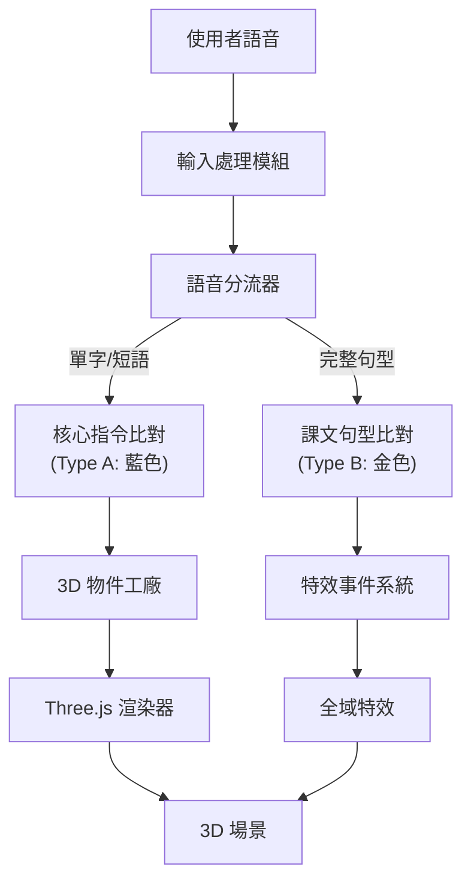

# AI Genesis: Bilingual Art Tech Island 實作計畫

## 專案概述

基於 PRD 文件 v0.6 規格，建構一款 Web-based 3D 生成式藝術教育應用。學生扮演「創世神」，透過英語語音指令驅動 AI 演算法，即時生成微型生態島嶼。

### 核心價值
- **即時回饋**：發音正確 → 物件生成；發音錯誤 → 無反應
- **自主迭代**：學生主動嘗試複雜詞彙以豐富畫面
- **去 LLM 化**：Rule-based 精準比對，非 AI 模糊推論
- **課程整合**：課本句型 = 魔法咒語

---

## User Review Required

> [!IMPORTANT]
> **專案範圍確認**：以下功能預計於本次實作完成，請確認優先順序
> 1. ✅ 基礎 3D 場景 (已有模版)
> 2. ⏳ 語音互動系統 (Web Speech API)
> 3. ⏳ 雙層咒語系統 (Type A + Type B)
> 4. ⏳ 全域特效 (天氣/時間/粒子)

> [!WARNING]
> **瀏覽器相容性**：Web Speech API 目前僅在 Chrome/Edge 上完整支援，Safari/Firefox 支援度有限。建議標注推薦瀏覽器。

---

## 技術架構



---

## Proposed Changes

### 專案結構

```
AI Genesis/
├── index.html          # [NEW] 主入口
├── css/
│   └── style.css       # [NEW] 設計系統
├── js/
│   ├── main.js         # [NEW] 主程式入口
│   ├── scene/
│   │   ├── SceneManager.js      # [NEW] 場景管理
│   │   ├── TerrainGenerator.js  # [NEW] 地形生成
│   │   └── ObjectFactory.js     # [NEW] 物件工廠
│   ├── speech/
│   │   ├── SpeechRecognizer.js  # [NEW] 語音辨識
│   │   ├── CommandMatcher.js    # [NEW] 指令比對
│   │   └── SpellDatabase.js     # [NEW] 咒語資料庫
│   ├── agents/
│   │   └── PersonAgent.js       # [NEW] AI 智能體
│   ├── effects/
│   │   ├── WeatherSystem.js     # [NEW] 天氣系統
│   │   └── ParticleSystem.js    # [NEW] 粒子系統
│   └── ui/
│       └── UIController.js      # [NEW] UI 控制器
├── island_v1.html      # [保留] 視覺參考模版
└── PRD - AI 雙語創世神 (AI Genesis).md  # [保留] 需求文件
```

---

### 核心模組 - 入口頁面

#### [NEW] [index.html](file:///c:/Users/USER/Desktop/AI%20Genesis/index.html)

主入口 HTML，包含：
- Three.js 的 import map
- 麥克風按鈕 UI
- 語音辨識字幕顯示區
- 控制面板

---

### 核心模組 - 場景生成

#### [NEW] [SceneManager.js](file:///c:/Users/USER/Desktop/AI%20Genesis/js/scene/SceneManager.js)

從 `island_v1.html` 移植並模組化：
- Three.js 初始化 (渲染器、相機、光源)
- OrbitControls 設定
- 動畫迴圈管理
- 視窗 resize 處理

#### [NEW] [TerrainGenerator.js](file:///c:/Users/USER/Desktop/AI%20Genesis/js/scene/TerrainGenerator.js)

地形生成邏輯：
- Grid 系統 (0:草地, 1:水, 2:障礙物)
- Random Walk 河流演算法
- 體素化地形 (Voxel Terrain)
- 動態水流 Shader

#### [NEW] [ObjectFactory.js](file:///c:/Users/USER/Desktop/AI%20Genesis/js/scene/ObjectFactory.js)

物件生成工廠：
- `createTree(x, y, z)` - 樹木 (含搖曳動畫)
- `createMountain(x, y, z)` - 山脈 (Low-Poly + 雪頂)
- `createHouse(x, y, z)` - 房屋 (含煙囪)
- `createPerson(x, y, z)` - 居民
- `createRiver(x, y, z)` - 河流

---

### 核心模組 - 語音系統

#### [NEW] [SpeechRecognizer.js](file:///c:/Users/USER/Desktop/AI%20Genesis/js/speech/SpeechRecognizer.js)

Web Speech API 封裝：
- 語音識別初始化與事件處理
- 按住說話 (Push-to-Talk) 機制
- 辨識結果回調

#### [NEW] [CommandMatcher.js](file:///c:/Users/USER/Desktop/AI%20Genesis/js/speech/CommandMatcher.js)

雙層咒語比對邏輯：
- **Type A 比對**：單字/短語 → 物件生成
  - 支援詞彙：`tree`, `mountain`, `house`, `person`, `river`
  - 形容詞修飾：`big`, `small`, `blue`, `green`
- **Type B 比對**：完整句型 → 全域特效
  - 模糊比對演算法 (Levenshtein Distance)
  - 容許些微發音誤差

#### [NEW] [SpellDatabase.js](file:///c:/Users/USER/Desktop/AI%20Genesis/js/speech/SpellDatabase.js)

咒語資料庫：
```javascript
// Type A: 創世指令
const CORE_COMMANDS = {
  'tree': { action: 'spawn', object: 'tree' },
  'mountain': { action: 'spawn', object: 'mountain' },
  'house': { action: 'spawn', object: 'house' },
  'person': { action: 'spawn', object: 'person' },
  'river': { action: 'spawn', object: 'river' }
};

// Type B: 魔法詠唱 (課本句型)
const TEXTBOOK_SPELLS = {
  "it's rainy": { effect: 'rain', description: '粒子降雨' },
  "good night": { effect: 'night', description: '夜晚模式' },
  "i am happy": { effect: 'happy', description: '愛心粒子' },
  "let's go": { effect: 'speed', description: '加速移動' }
};
```

---

### 核心模組 - AI 智能體

#### [NEW] [PersonAgent.js](file:///c:/Users/USER/Desktop/AI%20Genesis/js/agents/PersonAgent.js)

居民 AI 邏輯：
- 狀態機：`idle` ↔ `walk`
- 網格導航 (只走 Grid=0 草地)
- 避障邏輯 (避開水 Grid=1、障礙物 Grid=2)
- 跳躍動畫 (Sine wave bounce)

---

### 核心模組 - 全域特效

#### [NEW] [WeatherSystem.js](file:///c:/Users/USER/Desktop/AI%20Genesis/js/effects/WeatherSystem.js)

天氣系統：
- `triggerRain()` - 粒子降雨 + 河流漲潮
- `triggerNight()` - 天空變深藍 + 房屋亮燈
- `triggerSunny()` - 恢復日間

#### [NEW] [ParticleSystem.js](file:///c:/Users/USER/Desktop/AI%20Genesis/js/effects/ParticleSystem.js)

粒子系統：
- 雨滴粒子
- 愛心粒子
- 螢火蟲粒子

---

### 核心模組 - UI 控制器

#### [NEW] [UIController.js](file:///c:/Users/USER/Desktop/AI%20Genesis/js/ui/UIController.js)

UI 管理：
- 麥克風按鈕狀態 (按住 → 錄音中)
- 字幕框顯示 (藍色/金色雙色系統)
- 物件生成提示
- 特效觸發音效

---

### 樣式設計

#### [NEW] [style.css](file:///c:/Users/USER/Desktop/AI%20Genesis/css/style.css)

設計系統包含：
- CSS 變數 (顏色、間距、動畫)
- 麥克風按鈕樣式 (漸變按鈕 + 按壓效果)
- 字幕框樣式：
  - **Type A (藍色)**：`#4facfe` 漸層
  - **Type B (金色)**：`#FFD700` 發光效果
- 物件生成動畫 (Pop-up)
- 響應式佈局

---

## Verification Plan

### 自動化測試

由於本專案為純前端 3D 應用，無傳統 unit test 框架，將採用以下驗證策略：

#### 1. 靜態伺服器啟動
```powershell
# 在專案目錄執行
cd "c:\Users\USER\Desktop\AI Genesis"
npx -y serve .
```

#### 2. 瀏覽器功能測試 (Browser Subagent)
使用 browser_subagent 自動執行以下測試：
- [ ] 頁面載入成功
- [ ] 3D 場景正確渲染
- [ ] 麥克風按鈕可點擊
- [ ] OrbitControls 可操作

---

### 手動驗證

#### 語音辨識測試 (需使用者參與)

> [!NOTE]
> Web Speech API 需要麥克風權限，必須由使用者手動測試。

1. **開啟 Chrome 瀏覽器** (Edge 亦可)
2. **訪問應用** `http://localhost:3000`
3. **點擊允許麥克風權限**
4. **測試 Type A 指令**：
   - 按住麥克風按鈕
   - 說出 `"Tree"` → 期望看到樹木生成
   - 說出 `"Mountain"` → 期望看到山脈生成
5. **測試 Type B 咒語**：
   - 按住麥克風按鈕
   - 說出 `"It's rainy"` → 期望看到粒子降雨
   - 說出 `"Good night"` → 期望看到夜晚模式

---

## 開發階段規劃

| 階段 | 內容 | 預估工時 |
|------|------|----------|
| Phase 1 | 專案架構 + 場景移植 | 2-3 小時 |
| Phase 2 | 語音辨識 + 指令比對 | 2-3 小時 |
| Phase 3 | 全域特效系統 | 2-3 小時 |
| Phase 4 | UI/UX 優化 | 1-2 小時 |
| Phase 5 | 測試與調整 | 1-2 小時 |

**總預估**：8-13 小時
